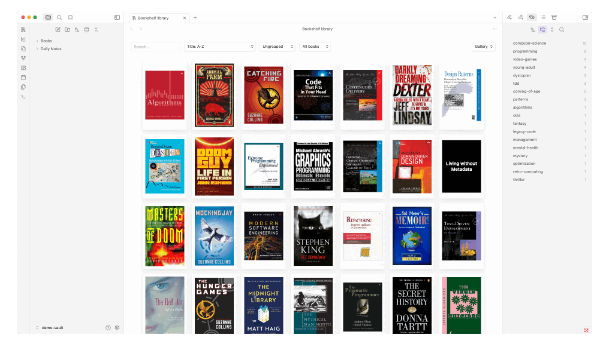

# Bookshelf

Your personal bookshelf in Obsidian. Access all your book notes in one place, track your reading progress, and gain
insights into your reading habits with beautiful charts.



## Installation

- Go to "Settings" > "Community plugins" and make sure "Restricted mode" is turned off
- Search for "Bookshelf" in Obsidian's community plugins browser
- Install and enable the plugin
- Open the plugin settings to customize as needed

## How to use

### Book Notes

Bookshelf collects book notes from the folder specified in the **Books folder** setting.
It currently processes the following metadata:

- Cover (property: `cover`)
- Author(s) (property: `author`)
- Publishing Date (property: `published`)
- Rating (property: `rating`)

If your book notes use different property names, you can customize them in the plugin's settings.

### Reading Progress

Bookshelf tracks your reading progress based on entries in your **book notes** and/or **daily notes**.
A reading progress entry consists of a date, a book, and a recorded action (such as starting, reading, or finishing a book).

You can specify the number of pages read by providing a start and end page, or just an end page.

- If only an end page is given, Bookshelf assumes the reading continued from the last recorded page.
- If no prior entry exists for the book, Bookshelf assumes reading started from page 1.

For example, if the first entry logs reading from pages 10 to 180, and the next entry specifies only page 290, Bookshelf
assumes you read from page 181 to 290.

Here's what entries in a book note look like using the default settings:

```markdown
- 2024-12-05: Started
- 2024-12-05: 10-180
- 2024-12-05: 290
- 2024-12-05: Finished
```

You don't have to specify the book in this case, because it's implied from the note.

Here's what entries in a daily note look like using the default settings:

```markdown
- Finished [[Frankenstein]]
- Started [[Dracula]]
- Read [[Dracula]]: 1-130
- Read [[Dracula]]: 210
- Abandoned [[Dracula]]
```

You don't have to specify the date, because it's implied from the note.

### Customizing Reading Progress

You can customize the format of your reading progress entries in Bookshelf's settings to match your preferred style.
To do this, you have to build patterns using tokens that match the entries in your book notes and/or daily notes.

You may use the following tokens in your patterns. Each pattern setting denotes which tokens are supported.

- `{book}` WikiLink to the book
- `{date}` Date of the entry formatted according to **Date format** setting
- `{startPage}` The page you started reading on
- `{endPage}` The last page you read
- `{*}` Can match any text between tokens

Let's say reading progress entries in your daily notes look like this:

```markdown
- Read [[The Shining]] from page 12 to page 133
```

In this case, you should use the following pattern: `Read {book} from page {startPage} to page {endPage}`.

If you prefer a more flexible format, your entries might look like this:

```markdown
- Read [[The Shining]] from page 12 to page 133
- Read [[The Shining]] from 133 to 151
- Read [[The Shining]] pages 134 to 190
```

In this case, the wildcard token allows you to match the dynamic text: `Read {book} {*} {startPage} {*} {endPage}`.
