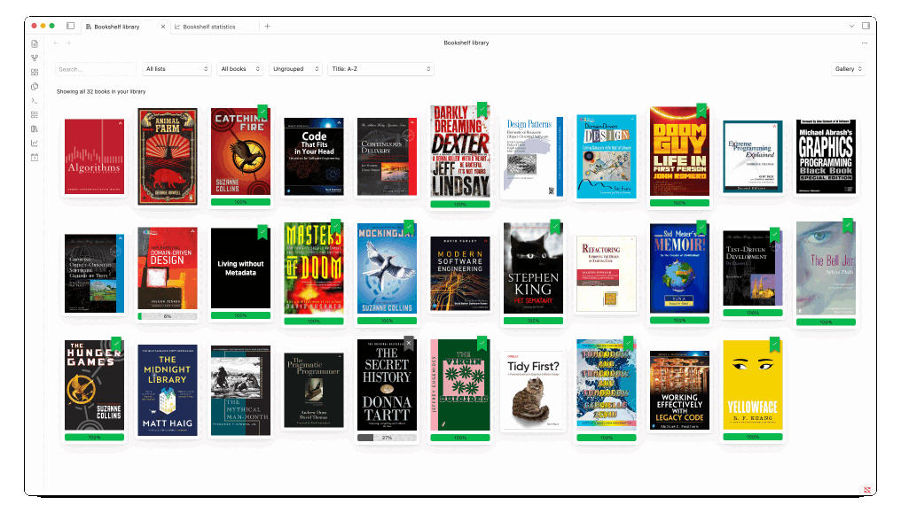

# Bookshelf

Your personal bookshelf and reading tracker in Obsidian.
Access all your book notes in one place, track your reading progress, and gain insights into your reading habits.

## Documentation

For detailed instructions on how to set up and use Bookshelf, see
the [Bookshelf documentation](https://weph.github.io/obsidian-bookshelf/).

## Reporting Bugs / Requesting Features / Contributing

If something isn't working as expected, or if you have an idea for a new feature:

1. First, check the [list of open issues](https://github.com/weph/obsidian-bookshelf/issues) to see if it has already
   been reported.
2. If it exists, give it a 👍 to help with prioritization
3. If it doesn't exist yet, [create a new issue](https://github.com/weph/obsidian-bookshelf/issues/new).

I'm not looking for code contributions. I work as a software developer full-time and this is a side project I do for
fun, so I'd like to keep it that way. Pull-requests require code reviews and discussions, sometimes about changes I'm
not even interested in. With AI tools it has become easy to swamp a project with changes. I don't have time for that.

## No AI used

No GenAI, AI Coding Agent, or similar tools were used to write this code. All this is human-made slop.

## Support

This plugin is completely free to use. That said, developing and maintaining software takes time and energy.
If Bookshelf has been helpful to you, consider supporting its development.

