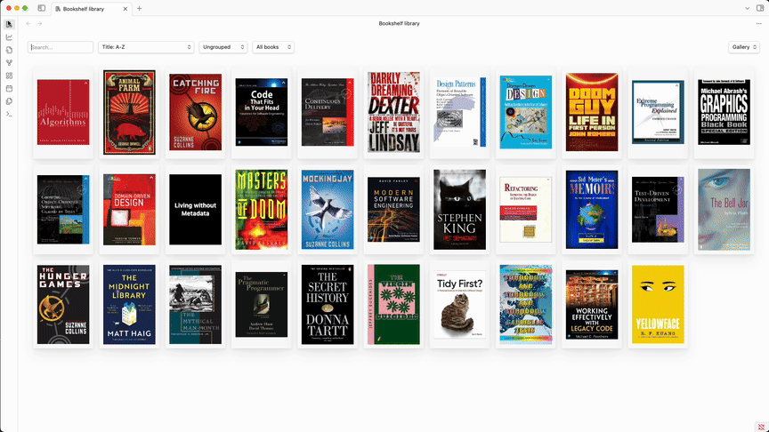

# Bookshelf

Your personal bookshelf in Obsidian. Access all your book notes in one place, track your reading progress, and gain
insights into your reading habits with beautiful charts.

## 📖 Documentation

For detailed instructions how to set up and use Bookshelf, see
the [Bookshelf documentation](https://weph.github.io/obsidian-bookshelf/).

## 🐛 Reporting Bugs / 💡 Requesting Features

If something isn't working as expected, or if you have an idea for a new feature:

1. First, check the [the list of open issues](https://github.com/weph/obsidian-bookshelf/issues) to see if it has
   already been reported.
2. If it exists, give it a 👍 to help with prioritization
3. If it doesn't exist yet, [create a new issue](https://github.com/weph/obsidian-bookshelf/issues/new).

## ❤️ Support

This plugin is completely free to use. That said, developing and maintaining software takes time and energy.
If Bookshelf has been helpful to you, consider supporting its development.

